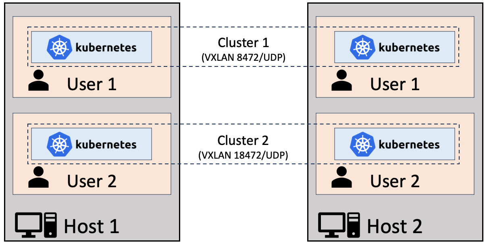

# Usernetes: Kubernetes without the root privileges (Generation 3)

Usernetes deploys a Kubernetes cluster without requiring root privileges on the host,
so as to mitigate potential container-breakout vulnerabilities.

Two deployment modes are supported:
- **Kubernetes-in-Docker** (default): Deploys a Kubernetes cluster inside [Rootless Docker](https://rootlesscontaine.rs/getting-started/docker/), [Rootless Podman](https://rootlesscontaine.rs/getting-started/podman/), or [Rootless nerdctl](https://rootlesscontaine.rs/getting-started/containerd/).
  This mode is similar to [Rootless `kind`](https://kind.sigs.k8s.io/docs/user/rootless/) and [Rootless minikube](https://minikube.sigs.k8s.io/docs/drivers/docker/),
  but Usernetes supports creating a cluster with multiple hosts.
- [**Kubernetes-in-Kubernetes**](./kubernetes/README.md): Usernetes runs inside an existing Kubernetes cluster, as [UserNS-enabled pods](https://kubernetes.io/docs/concepts/workloads/pods/user-namespaces/) (`hostUsers: false`).

## Project history
- **Generation 1** ([`gen1`](https://github.com/rootless-containers/usernetes/tree/gen1) branch, 2018-2023):
  The original Usernetes, implemented in the style of ["Kubernetes The Hard Way"](https://github.com/kelseyhightower/kubernetes-the-hard-way).
  This generation was hard to use due to lack of support for kubeadm.
- **Generation 2** ([`gen2`](https://github.com/rootless-containers/usernetes/tree/gen2) branch, 2023-2026):
  Switched to **Kubernetes-in-Docker** mode for simplicity. This switch enabled supporting kubeadm.
- **Generation 3** (2026-present):
  Additionally added support for **Kubernetes-in-Kubernetes** mode.

## Components
- Cluster configuration: kubeadm
- CRI: containerd
- OCI: runc
- CNI: Flannel (default) or Calico (VXLAN mode; Kubernetes-in-Docker mode only)

> [!NOTE]
> The documentation below is for the **Kubernetes-in-Docker** mode.
> See [`./kubernetes`](./kubernetes/README.md) for the **Kubernetes-in-Kubernetes** mode.

## Requirements

- One of the following host operating system:

|Host operating system|Minimum version|
|---------------------|---------------|
|Ubuntu (recommended) |22.04          |
|Rocky Linux          |9              |
|AlmaLinux            |9              |
|Fedora               |(?)            |

- One of the following container engines:

|Container Engine                                                                    |Minimum version|
|------------------------------------------------------------------------------------|---------------|
|[Rootless Docker](https://rootlesscontaine.rs/getting-started/docker/) (recommended)|v20.10         |
|[Rootless Podman](https://rootlesscontaine.rs/getting-started/podman/)              |v4.x           |
|[Rootless nerdctl](https://rootlesscontaine.rs/getting-started/containerd/)         |v1.6           |

```bash
curl -o install.sh -fsSL https://get.docker.com
sudo sh install.sh
dockerd-rootless-setuptool.sh install
```

- systemd lingering:
```bash
sudo loginctl enable-linger $(whoami)
```

- cgroup v2 delegation:
```bash
sudo mkdir -p /etc/systemd/system/user@.service.d

sudo tee /etc/systemd/system/user@.service.d/delegate.conf <<EOF >/dev/null
[Service]
Delegate=cpu cpuset io memory pids
EOF

sudo systemctl daemon-reload
```

- Kernel modules:
```
sudo tee /etc/modules-load.d/usernetes.conf <<EOF >/dev/null
br_netfilter
vxlan
EOF

sudo systemctl restart systemd-modules-load.service
```

- sysctl:
```
sudo tee /etc/sysctl.d/99-usernetes.conf <<EOF >/dev/null
net.ipv4.conf.default.rp_filter = 2
EOF

sudo sysctl --system
```

- [Podman only] Custom configuration (since Podman v5):
```
# Podman v5
mkdir -p "$HOME/.config/containers/containers.conf.d"
cat <<EOF >"$HOME/.config/containers/containers.conf.d/slirp4netns.conf"
[network]
# change the network mode from pasta to slirp4netns
default_rootless_network_cmd="slirp4netns"
EOF
```
```
# Podman v6
mkdir -p "$HOME/.config/containers/containers.conf.d"
cat <<EOF >"$HOME/.config/containers/containers.conf.d/pasta.conf"
[network]
default_rootless_network_cmd="pasta"
# change the port forwarder from rootlessport to pasta
rootless_port_forwarder="pasta"
# use a dedicated address (same as the slirp4netns default) instead of
# copying the host's IP address, so that connections to the host's IP
# address from inside the namespace are routed out to the host
pasta_options=["-a", "10.0.2.100", "-n", "24", "-g", "10.0.2.2"]
EOF
```

Use scripts in [`./init-host`](./init-host) for automating these steps.

## Usage
See `make help`.

```bash
# Bootstrap a cluster
make up
make kubeadm-init
make install-cni

# Enable kubectl
make kubeconfig
export KUBECONFIG=$(pwd)/kubeconfig
kubectl get pods -A

# Multi-host
make join-command
scp join-command another-host:~/usernetes
ssh another-host make -C ~/usernetes up kubeadm-join
make sync-external-ip

# Debug
make logs
make shell
make kubeadm-reset
make down-v
kubectl taint nodes --all node-role.kubernetes.io/control-plane-
```

The container engine defaults to Docker.
To change the container engine, set `export CONTAINER_ENGINE=podman` or `export CONTAINER_ENGINE=nerdctl`.

The CNI defaults to Flannel.
To use Calico (VXLAN mode), set `export CNI=calico` before running
`make up` and `make install-cni`.

### Customization

The following environment variables are recognized:

Name                  | Type    | Default value
----------------------|---------|----------------------------------------------------------------
`CONTAINER_ENGINE`    | String  | automatically resolved to "docker", "podman", or "nerdctl"
`CNI`                 | String  | "flannel" ("flannel" or "calico"; has to be set on `make up`)
`HOST_IP`             | String  | automatically resolved to the host's IP address
`NODE_NAME`           | String  | "u7s-" + the host's hostname
`NODE_SUBNET`         | String  | "10.100.%d.0/24" (%d is computed from the hash of the hostname)
`PORT_ETCD`           | Integer | 2379
`PORT_KUBELET`        | Integer | 10250
`PORT_FLANNEL`        | Integer | 8472
`PORT_CALICO`         | Integer | 4789
`PORT_CALICO_TYPHA`   | Integer | 5473 (host port only; the container port is fixed)
`PORT_KUBE_APISERVER` | Integer | 6443
`POD_SUBNET`          | String  | "10.244.0.0/16"
`SERVICE_SUBNET`      | String  | "10.96.0.0/16"

## Limitations
- Node ports cannot be exposed automatically. Edit [`docker-compose.yaml`](./docker-compose.yaml) for exposing additional node ports.
- Most of host files are not visible with `hostPath` mounts. Edit [`docker-compose.yaml`](./docker-compose.yaml) for mounting additional files.
- Some [volume drivers](https://kubernetes.io/docs/concepts/storage/volumes/) such as `nfs` do not work.

## Advanced topics
### Network
When `CONTAINER_ENGINE` is set to `nerdctl`, [bypass4netns](https://github.com/rootless-containers/bypass4netns) can be enabled for accelerating `connect(2)` syscalls.
The acceleration currently does not apply to VXLAN packets.

```bash
containerd-rootless-setuptool.sh install-bypass4netnsd
export CONTAINER_ENGINE=nerdctl
make up
```

> [!NOTE]
>
> The support for bypass4netns is still experimental

### Multi-tenancy

Multiple users on the hosts may create their own instances of Usernetes, but the port numbers have to be changed to avoid conflicts.

```bash
# Default: 2379
export PORT_ETCD=12379
# Default: 10250
export PORT_KUBELET=20250
# Default: 8472
export PORT_FLANNEL=18472
# Default: 4789
export PORT_CALICO=14789
# Default: 5473. Multiple Calico instances cannot share a host, as the
# container port of Typha is not configurable; setting this just avoids
# conflicting with the Typha port of another (Calico) instance.
export PORT_CALICO_TYPHA=15473
# Default: 6443
export PORT_KUBE_APISERVER=16443

make up
```



### Rootful mode
Although Usernetes is designed to be used with Rootless Docker, it should work with the regular "rootful" Docker too.
This might be useful for some people who are looking for "multi-host" version of [`kind`](https://kind.sigs.k8s.io/) and [minikube](https://minikube.sigs.k8s.io/).
